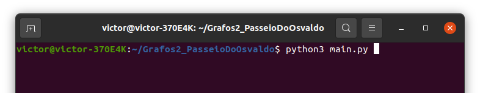
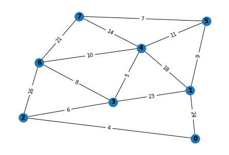
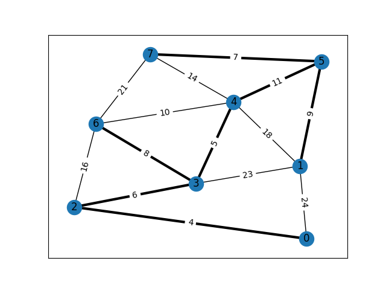

# Passeio do Osvaldo

**Número da Lista**: 2  
**Conteúdo da Disciplina**: Grafos 2  

## Alunos
|  Matrícula  |            Aluno           |
|    --       |             --             |
| 14/0031634  |  Stefânia Bezerra da Silva |
| 15/0150741  |  Victor Alves Gomide       |

## Sobre 

Osvaldo é um vovô garoto que gosta de passear pela manhã. Ultimamente as manhãs de Brasília estão bastante chuvosas e, como ele não abre mão da sua caminhadinha diária, ele tem de percorrer os seus lugares preferidos antes que a chuva comece.

Pensando nisso, resolvemos desenvolver o melhor caminho para ele percorrer antes de se molhar (já que ele não gosta de tomar banho).

Nesse trabalho foi implementado:
* Um algoritmo de Prim que apresenta uma árvore geradora mínima com o menor destino a ser trilhado;
* Visualização da árvore mínima sobre o grafo original (o menor caminho se encontra com as arestas em negrito).

## Screenshots

## Instalação 
**Linguagem**: Python 
**Framework**: Não foi utilizado 

**Passos para a instalação**:

1) Primeiramente o usuário deverá clonar o repositório:

`git clone https://github.com/projeto-de-algoritmos/Grafos2_PasseioDoOsvaldo`

2) Depois do repositório clonado, você deverá instalar o Python caso não tenha em sua máquina:

` sudo apt-get install python3`

3) Instalar as bibliotecas que serão usadas:

`pip install pyvis`

`pip install networkx`

`pip install matplotlib`

## Uso 

Depois de instalar as dependências acima, o usuário precisará apenas compilar o código no terminal:

` python3 main.py`

